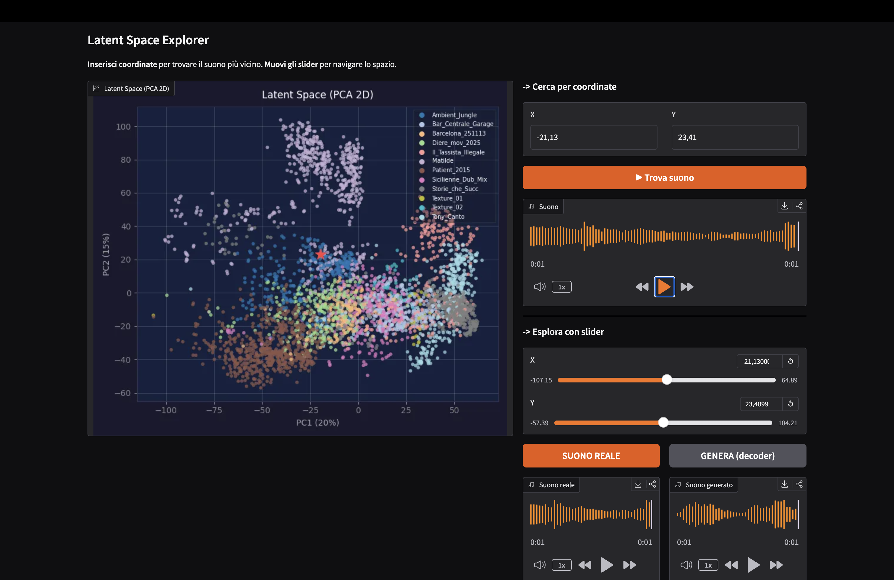
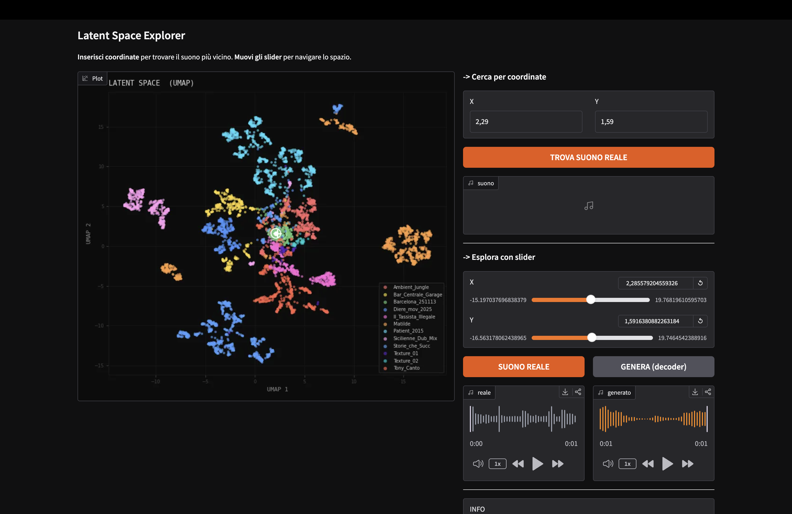
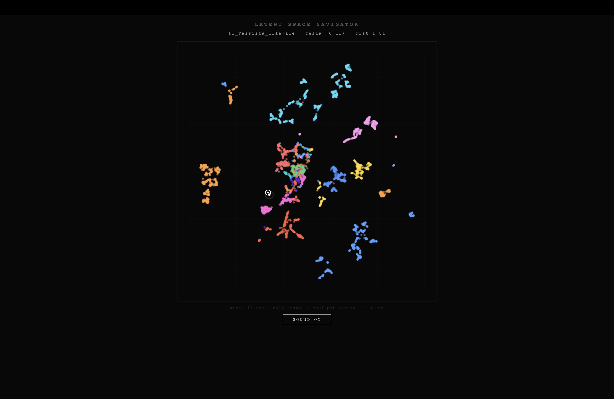

# Small AI — Latent Space Navigator

Codice sviluppato per il paper *Small AI: modelli locali come pratica di liuteria digitale*. Il repository è disponibile pubblicamente così che chiunque possa addestrare il proprio modello a partire dal proprio materiale sonoro.
Un autoencoder convoluzionale leggero (~500k parametri) addestrato localmente su un corpus sonoro personale. L'encoder comprime ogni frammento audio in un vettore di 16 numeri (lo spazio latente) e il decoder lo ricostruisce. Lo spazio latente risultante è una mappa timbrica del materiale di training: suoni simili si raggruppano, le zone intermedie tra cluster corrispondono a ibridazioni sonore non presenti nel corpus originale. Quella mappa è navigabile e usabile come strumento di esplorazione ed esecuzione.

---

## Requisiti

```bash
pip install torch torchaudio librosa soundfile numpy umap-learn scikit-learn 
            gradio aiohttp aiofiles python-osc matplotlib pathlib
```

Python ≥ 3.10 raccomandato. Per la demo OSC con Max/MSP: `pip install python-osc`.

---

### Sample rate e durata segmenti

Il codice usa per default `SAMPLE_RATE = 44100` Hz e segmenti di `1.0` secondo. Puoi cambiarli in `dataset.py` modificando le costanti in cima al file:

```python
SAMPLE_RATE = 44100   
DURATION    = 1.0     
```

Se cambi `SAMPLE_RATE`, aggiorna lo stesso valore anche in `build_dataset.py`. I due file devono essere allineati.

---

## 1. Prepara il dataset

Metti i tuoi file audio (`.wav` o `.aiff`) nella cartella `data/`.

```
data/
├── mia_traccia_1.wav
├── mia_traccia_2.aiff
└── ...
```

Poi esegui:

```bash
python build_dataset.py --input_dir ./data --output_dir ./data_processed
```

Il comando rileva automaticamente gli **onset** (momenti di attacco sonoro) di ogni traccia, estrae un segmento di 1 secondo per ciascuno e scarta i segmenti troppo silenziosi.

Output:

```
data_processed/
├── audio/          ← segmenti .wav da 1 secondo
└── examples.json   ← metadati
```

### Parametri utili

| Parametro | Default | Quando modificarlo |
|---|---|---|
| `--rms_threshold` | `0.01` | Abbassa se scarti troppo materiale soft/ambient |
| `--onset_delta` | `0.07` | Abbassa per catturare più onset; alza per solo i transient forti |
| `--min_gap` | `0.5` | Aumenta se estrai troppi segmenti quasi identici ravvicinati |

---

## 2. Modello

Un autoencoder convoluzionale leggero (~500k parametri). L'encoder comprime ogni mel-spettrogramma `(1, 100, 64)` in un vettore di **16 numeri**; il decoder lo ricostruisce. Durante il training viene aggiunto un piccolo rumore gaussiano al vettore latente (`noise_std=0.1`), che rende lo spazio più continuo e le interpolazioni più fluide.

Si usa un autoencoder puro invece di un VAE perché su dataset piccoli il VAE tende a collassare — il latent space diventa piatto e le interpolazioni non funzionano.

---

## 3. Training

```bash
python train.py --data_dir ./data_processed --epochs 200
```

I checkpoint vengono salvati in `checkpoints/` ogni 10 epoch. Il modello finale è `checkpoints/ae_final.pt`. Durante il training vengono generati automaticamente plot PCA + UMAP dello spazio latente ogni 5 epoch in `checkpoints/plots/`.

### Parametri utili

| Parametro | Default | Note |
|---|---|---|
| `--epochs` | `200` | 100 è sufficiente per dataset piccoli |
| `--batch_size` | `32` | Riduci a 16 se hai poca RAM |
| `--latent_dim` | `16` | Dimensione dello spazio latente |
| `--noise_std` | `0.1` | Rumore sul latent — aumenta per spazio più smooth |
| `--max_samples` | tutti | Limita il numero di segmenti usati |

Il training su ~3000 segmenti richiede circa 10–20 minuti su CPU, meno di 5 su Apple Silicon o GPU.

---

## 4. Demo

Una volta addestrato il modello, lo spazio latente può essere esplorato e usato in modi diversi. 
Qui vengono proposte due demo che sono state costruite con approcci opposti: una statica e orientata alla ricerca e raccolta di materiale, l'altra è invece dinamica e orientata all'esecuzione in tempo reale.

---

### Demo A — Esplorazione statica interattiva

Due versioni della stessa interfaccia, una con proiezione **PCA** e una con **UMAP**:



```bash
python demo_pca.py  --checkpoint ./checkpoints/ae_final.pt --data_dir ./data_processed
python demo_umap.py --checkpoint ./checkpoints/ae_final.pt --data_dir ./data_processed
```

Apri `http://localhost:7860` nel browser.

L'interfaccia permette di scegliere un punto nello spazio latente in due modi: inserendo coordinate numeriche o muovendo degli slider. Per ogni punto è possibile ascoltare due cose in parallelo — il suono reale più vicino nel dataset, recuperato direttamente dal file `.wav` originale, e il suono generato dal decoder in quel punto, che è un suono nuovo prodotto dall'interpolazione. Entrambi i suoni sono scaricabili, il che rende questa demo utile anche come strumento di raccolta: si naviga la mappa, si ascolta, si scaricano i suoni interessanti e li si porta nella propria pratica.

| Parametro | Default | Note |
|---|---|---|
| `--max_samples` | tutti | Limita i suoni caricati (utile per test rapidi) |
| `--port` | `7860` | Porta del server Gradio |
| `--share` | off | Aggiunge `--share` per un link pubblico temporaneo |

---

### Demo B — Navigazione dinamica in tempo reale con il mouse



Questa demo richiede uno step preliminare: il **pre-rendering** della griglia. Il decoder genera in anticipo un suono per ogni cella di una griglia N×N che copre lo spazio UMAP, e li salva su disco.

```bash
python prerender.py --checkpoint ./checkpoints/ae_final.pt \
                    --data_dir   ./data_processed \
                    --grid_size  20 \
                    --n_iter     32 \
                    --output_dir ./grid_audio
```

| Parametro | Default | Note |
|---|---|---|
| `--grid_size` | `20` | Griglia 20×20 = 400 suoni; 30×30 = 900 |
| `--n_iter` | `32` | Iterazioni Griffin-Lim: 128 = qualità, 32 = veloce, 8 = molto veloce |
| `--output_dir` | `./grid_audio` | Dove salvare i file pre-renderizzati |

Una volta completato il pre-rendering, avvia la demo:

```bash
python demo_mouse.py --checkpoint ./checkpoints/ae_final.pt \
                     --data_dir   ./data_processed \
                     --grid_dir   ./grid_audio
```

Apri `http://localhost:8080` nel browser. Muovendo il mouse sulla mappa UMAP il suono cambia in tempo reale — ogni cella della griglia corrisponde a un suono pre-renderizzato che viene caricato con crossfade automatico. Il bottone `SOUND ON/OFF` permette di attivare e disattivare il flusso audio. L'uscita dal canvas ferma il suono.

Questa modalità è pensata per l'esecuzione e l'improvvisazione: la mappa diventa uno strumento da suonare con il gesto.
